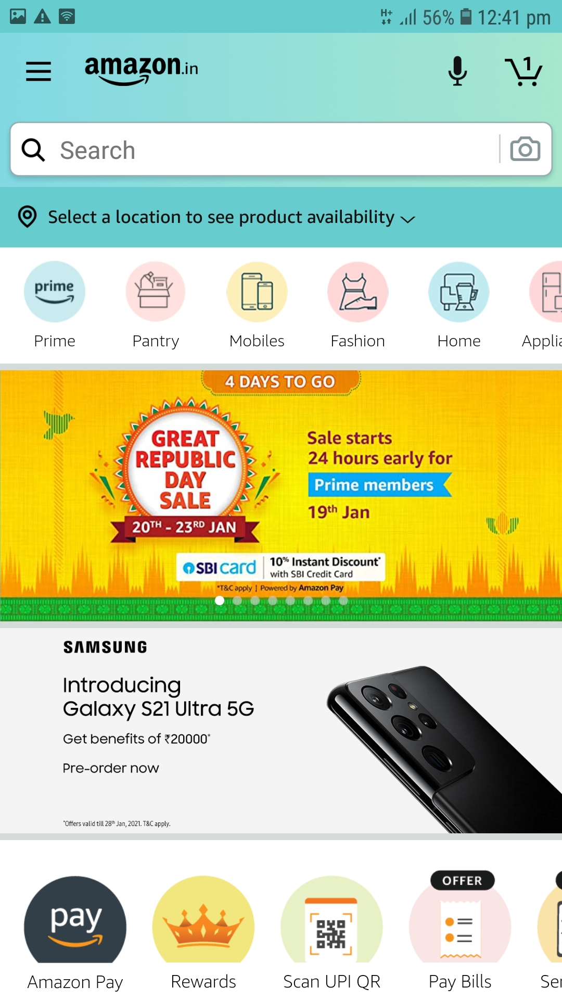
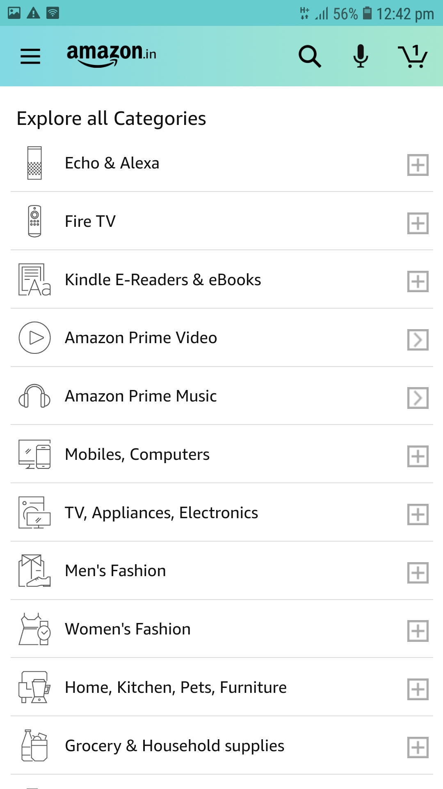
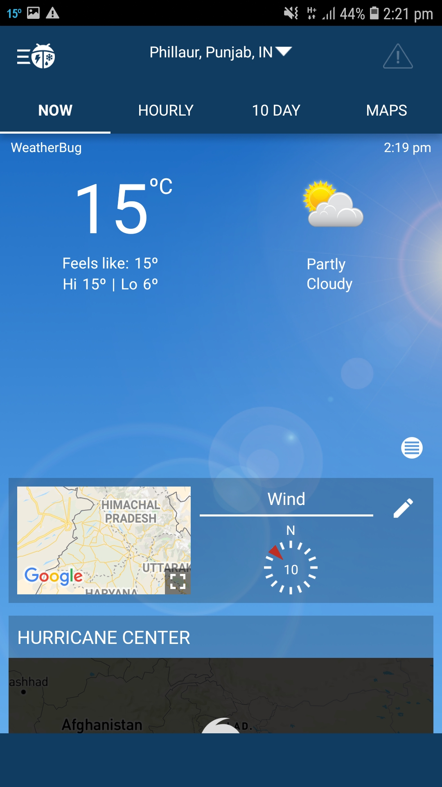
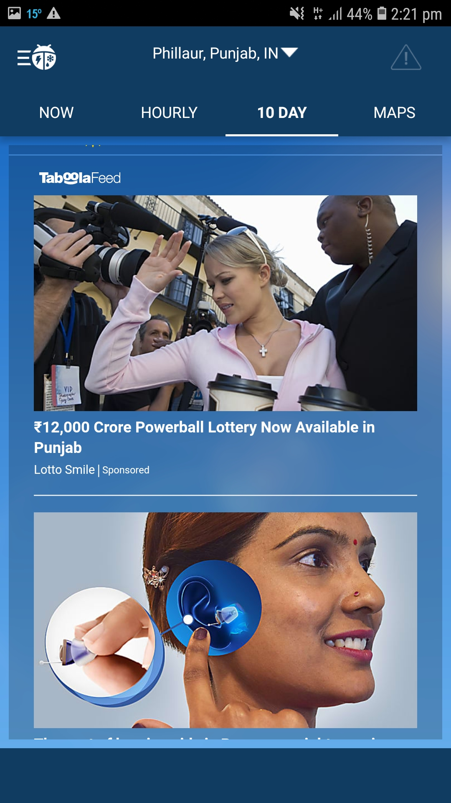
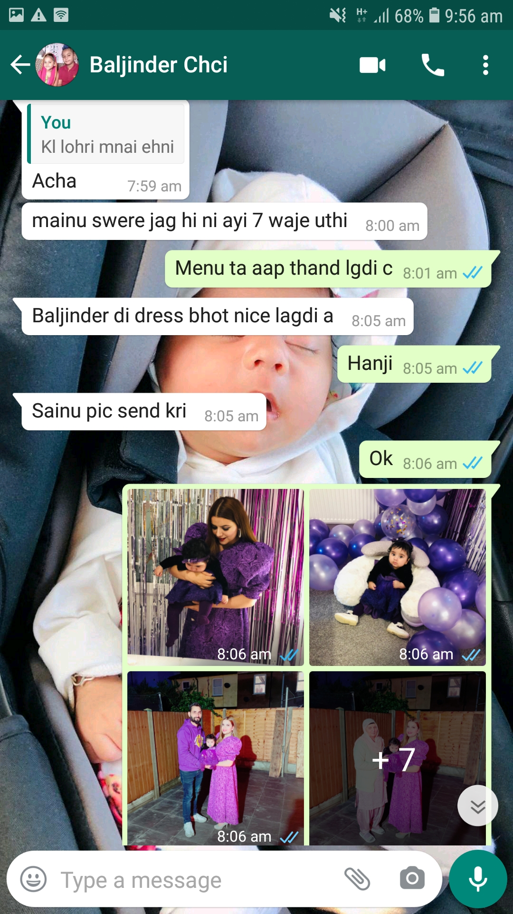
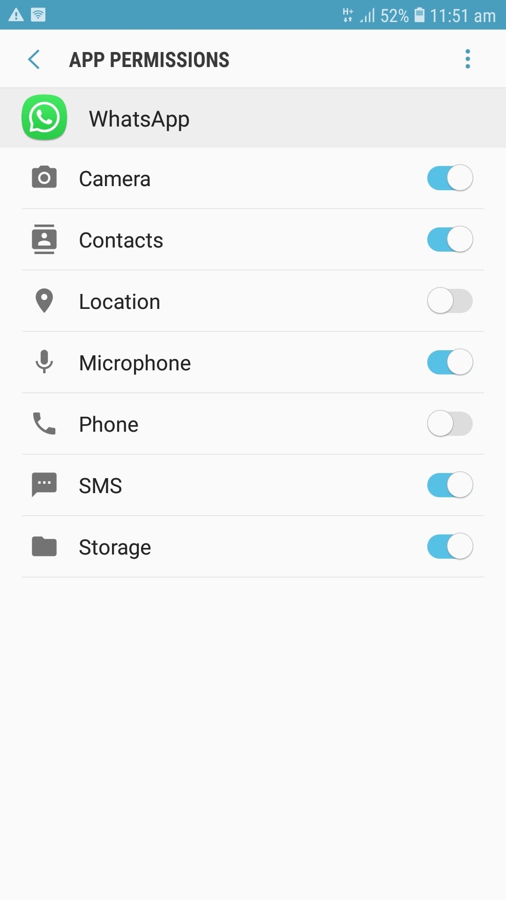

# DGL-114-portfolio-
## Week 1 process portfolio
### Activity = 0101 
## Best interface mobile app(Amazon)

>I think Amazon is of the best shopping app that i love to use because it is easy to operate and it is very user friendly.Secondly,once we stored our personal information like our address and card details then we can easily buy anything without wasting time.
  
Besides that, it affers things for everyone and all the information is placed conveninently so it is easy to navigate. As you can see that below: 

Apart from that, various kinds of filters and product lists are available which helps users for finding their required product in fraction of seconds.

## Poor interface mobile app(Weatherbug)

The Weatherbug mobile app is one of the weather app that i consider it has bad user interface beacuse its main screen is cover with full of ads that looks too ugly and busy.

Secondly ,some advertisements put negative effect on users mind because they show inapproprieate content.

And most of user prefer something simple and clean,clear that fulfill their needs and purpose by installing it,i personally used this app and after two days i uninstalled it.

## Activity  = 0102

<h2>'Intuitive'mobile interface</h2>

> Intuitive user interface means user friendly product that is easy to use and learn without knowing anything special in prior. in other words, intuitive design direct people's attention to task that are important and it focus on user experience.
## 'Usable' and 'Intuitive' elements
<h2> 1. Icons  
Icons are the best way of adding interaction to UI design.
<h2> 2.Checkboxes</h2> 
It allow your users to select one or more options from a set.
<h2> 3. Radio Button</h2>
Radio button allow users to select a one item at a time.
<h2> 4. Color scheme </h2>
Colors can be excellent tool to enhace the readability and using good color combination can easily attract new users and it improve UI design.
<h2> 5. Font </h2>
Font is also one of the major intuitive element of any app,you can use font as a way to guide your users attention to important elements.
<h2> 6. Good visual design </h2>
It is also very important usable element because it is more informative and scannable.
<h2> 7. Primary text </h2>
It is a main text element of any app and product that describe the most piece of information for their users,so it should be appropriate and meaningful

# Week 2 Activities
## Activity  0201
### Frequently used Mobile app= **WhatsApp**(Android)
>**WhatsApp** is one of the most popular social networking app that is used worldwide,and it is very usefull app that helps people to keep in touch with each other in convienent way.
### Features of WhatsApp(app)

1. **Voice and video call feature**: People can talk with their friends and family members for free, you just need a internet connection for calling to each other even if your known one's in another country.Thus,people can have face to face conversation feature when they miss someone.

2. **Share images and documents**: WE can send photos and video and other documents instantly on whatapp.

3. **camera** : Whatsapp also have their own camera feature that is very good feature of that.
4. **Provide security feature**: In whatapp all the text and data are end to end encripted,so your messages and calls are secure from any threat.
5. **Send voice note**: We can also voice note to each other in a fraction of second.
6. **Group chat and calling facility**:In whatsapp we can also do group chat and group calling,so that is one of its amazing feature and people love group calling and they feel so close to each other.
7. **Share updates in the form of status**: People can show some of their favourite stuf like pictures,acticles,songs and web page link with their friends on the status field,so everyone can easily see any update on it.
8.**Available for desktop also**: Its desktop version is also available so people can use any of its version as per their requirements.
## WhatsApp permissions
Whatsapp gives us the following permissions :
1. **Camera**

2. **Contacts**

3. **Location**

4. **Microphone**

5. **Phone**

6. **SMS**

7. **Storage**

## Activity  0203
### Material design
>I really like this site because everything is outstanding and there is nothing wrong if we said it is for everyone.For example in the study material we can easily find something as per our requirements.variety of study materail are available such as:

**Basil**= Recipe app that use material design component

**Crane**= Travel app

**Fortnightly**= News app

**Owl**= Educatinal app

**Rally**=Personal finacial app**

**Reply**=Email app

**Shrine**=Retail app

### More interesting page
>I love everything on this site but i like **Basin** more from the study material because i never seen any perfact design app of food and recipe and am very foody person so that's why i explore that area in depth.Its architecture is soo simple and easy to operate and its special feature is that it consider all of their users from desktop to mobile.

>Its color combination and typography everything is perfact and am also working on my adobe xd assignment for creating moodboard and landing page where i need to choose good colors and typeface so it helps me to learn more about app and its design components.

