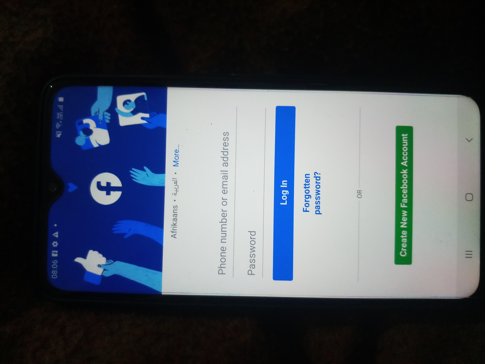
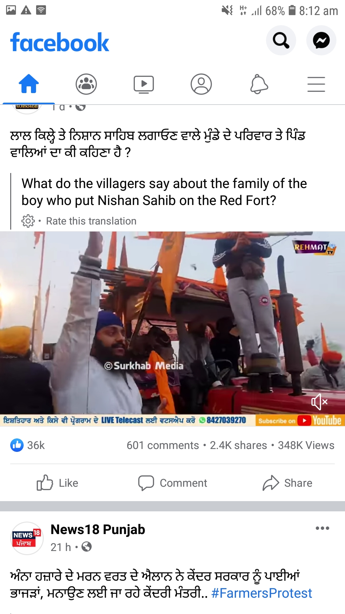
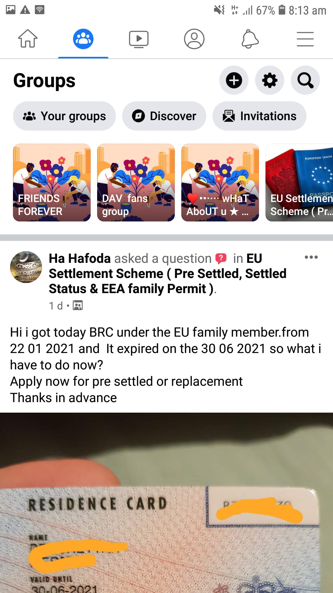
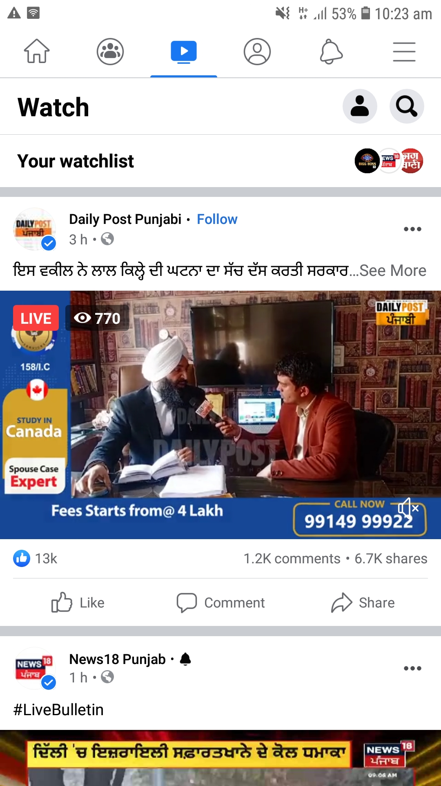
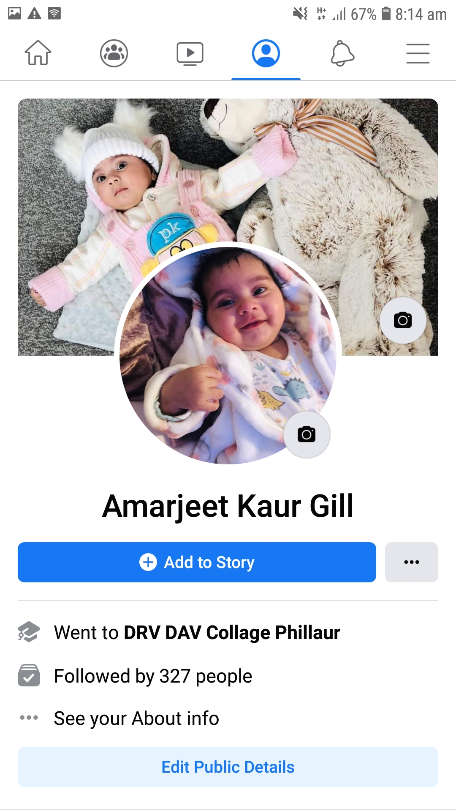
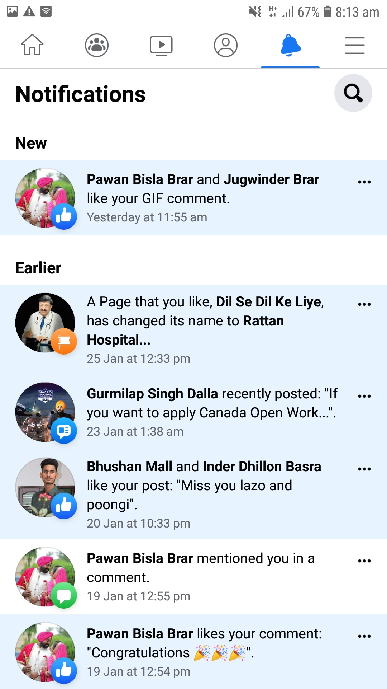
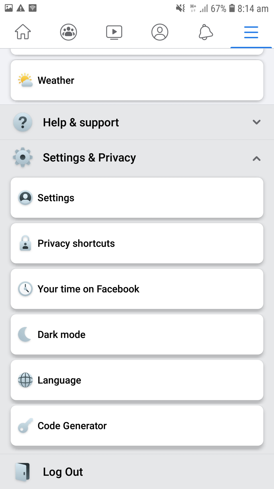
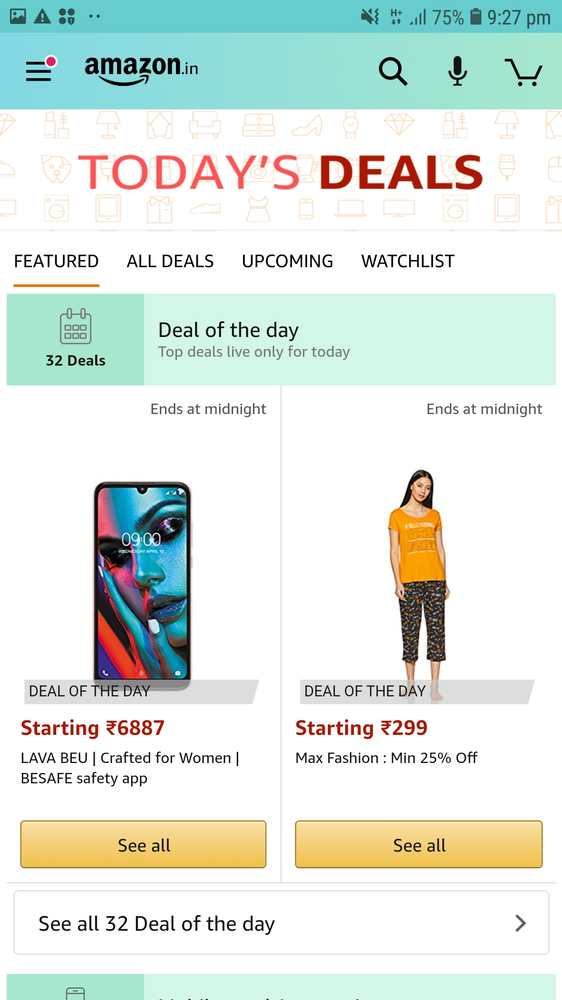
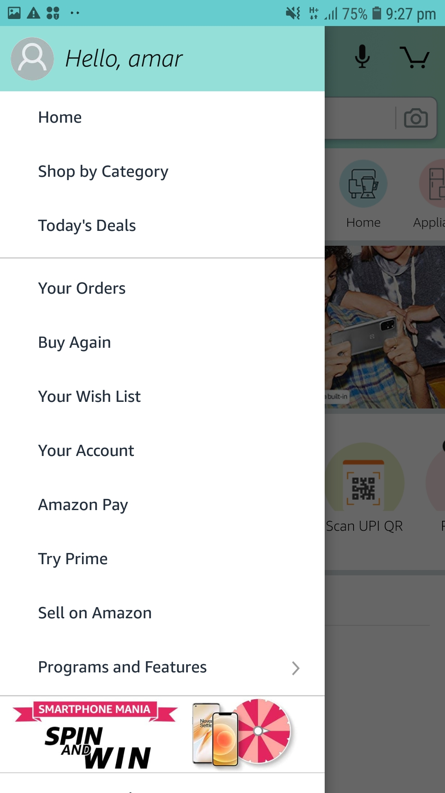
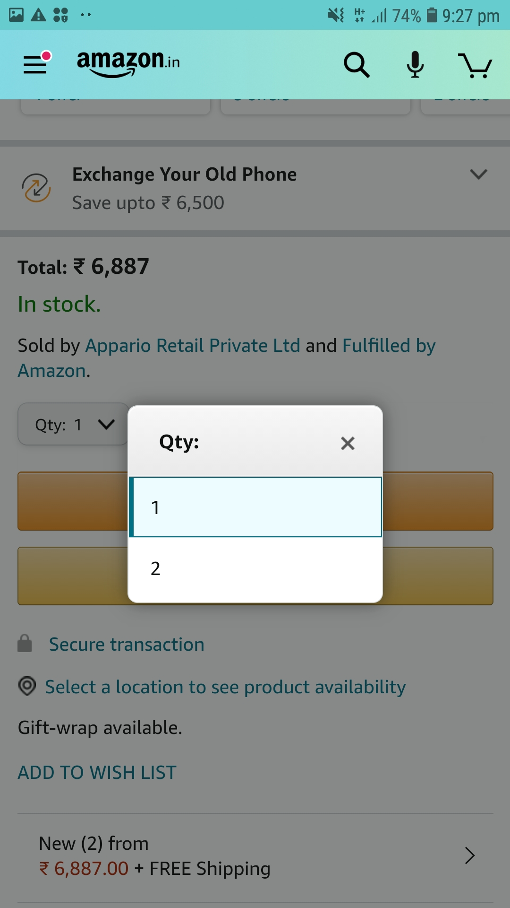

# DGL-114-portfolio-
## Week 1 process portfolio
### Activity = 0101 
## Best interface mobile app(Amazon)

>I think Amazon is of the best shopping app that i love to use because it is easy to operate and it is very user friendly.Secondly,once we stored our personal information like our address and card details then we can easily buy anything without wasting time.
  
Besides that, it affers things for everyone and all the information is placed conveninently so it is easy to navigate. As you can see that below: 

Apart from that, various kinds of filters and product lists are available which helps users for finding their required product in fraction of seconds.

## Poor interface mobile app(Weatherbug)

The Weatherbug mobile app is one of the weather app that i consider it has bad user interface beacuse its main screen is cover with full of ads that looks too ugly and busy.

Secondly ,some advertisements put negative effect on users mind because they show inapproprieate content.

And most of user prefer something simple and clean,clear that fulfill their needs and purpose by installing it,i personally used this app and after two days i uninstalled it.

## Activity  = 0102

<h2>'Intuitive'mobile interface</h2>

> Intuitive user interface means user friendly product that is easy to use and learn without knowing anything special in prior. in other words, intuitive design direct people's attention to task that are important and it focus on user experience.
## 'Usable' and 'Intuitive' elements
<h2> 1. Icons  
Icons are the best way of adding interaction to UI design.
<h2> 2.Checkboxes</h2> 
It allow your users to select one or more options from a set.
<h2> 3. Radio Button</h2>
Radio button allow users to select a one item at a time.
<h2> 4. Color scheme </h2>
Colors can be excellent tool to enhace the readability and using good color combination can easily attract new users and it improve UI design.
<h2> 5. Font </h2>
Font is also one of the major intuitive element of any app,you can use font as a way to guide your users attention to important elements.
<h2> 6. Good visual design </h2>
It is also very important usable element because it is more informative and scannable.
<h2> 7. Primary text </h2>
It is a main text element of any app and product that describe the most piece of information for their users,so it should be appropriate and meaningful

# Week 2 Activities
## Activity  0201
### Frequently used Mobile app= **WhatsApp**(Android)
>**WhatsApp** is one of the most popular social networking app that is used worldwide,and it is very usefull app that helps people to keep in touch with each other in convienent way.
### Features of WhatsApp(app)

1. **Voice and video call feature**: People can talk with their friends and family members for free, you just need a internet connection for calling to each other even if your known one's in another country.Thus,people can have face to face conversation feature when they miss someone.

2. **Share images and documents**: WE can send photos and video and other documents instantly on whatapp.

3. **camera** : Whatsapp also have their own camera feature that is very good feature of that.
4. **Provide security feature**: In whatapp all the text and data are end to end encripted,so your messages and calls are secure from any threat.
5. **Send voice note**: We can also voice note to each other in a fraction of second.
6. **Group chat and calling facility**:In whatsapp we can also do group chat and group calling,so that is one of its amazing feature and people love group calling and they feel so close to each other.
7. **Share updates in the form of status**: People can show some of their favourite stuf like pictures,acticles,songs and web page link with their friends on the status field,so everyone can easily see any update on it.
8.**Available for desktop also**: Its desktop version is also available so people can use any of its version as per their requirements.
## WhatsApp permissions
Whatsapp gives us the following permissions :
1. **Camera**

2. **Contacts**

3. **Location**

4. **Microphone**

5. **Phone**

6. **SMS**

7. **Storage**

## Activity  0203
### Material design
>I really like this site because everything is outstanding and there is nothing wrong if we said it is for everyone.For example in the study material we can easily find something as per our requirements.variety of study materail are available such as:

**Basil**= Recipe app that use material design component

**Crane**= Travel app

**Fortnightly**= News app

**Owl**= Educatinal app

**Rally**=Personal finacial app

**Reply**=Email app

**Shrine**=Retail app

### More interesting page
>I love everything on this site but i like **Basin** more from the study material because i never seen any perfact design app of food and recipe and am very foody person so that's why i explore that area in depth.Its architecture is soo simple and easy to operate and its special feature is that it consider all of their users from desktop to mobile.

>Its color combination and typography everything is perfact and am also working on my adobe xd assignment for creating moodboard and landing page where i need to choose good colors and typeface so it helps me to learn more about app and its design components.

# Week 3 Activities
## Activity  0301
### Frequently used Mobile app= **Facebook**(Android)
> Nowadays smart phone plays an important role in our lives and it is very hard to identify each and every screen of mobile apps but i will do my best to explain about each screen and activity of *Facebook* mobile aap

## <table><tr>All activities(Screens)

### Login screen

>This is the first screen of facebook mobile aap,it is a login screen where there are usually two fields where user need to fill their email adress or phone number then enter their passward along with login button.old user can also reset their passward if they did not remember.

>New user can also need to sign up for creating their account on facebook.
</img>

### Social screen Feed

>As we know most of the people following the news and updates through social networking app ,so in facebook app people can easily get updates about news and updates around them.

> </img>

### Groups fields

>On facebook you can see group field where people can join any group as per their chooise ,it is basically showed your all joining group list along with posts and latest updates about that.You can see it below :

> </img>

### Watch fields

>This watch field is basically for audio video support,people can easily watch any video clip from any page or news cahnnel directly,you can find here long list of video clips :

> </img>

### Home field

> Home field is basically for users profile where user can upload any image ,songs,video and so on .user can also edit their profile by selecting edit profile link over there : 

> </img>

### Notification field

> In the notification field user can get notification from their friends activities as well as from news channels .it is basically from those people whose pages and profile we add or follow from our id.

> </img>

### Privacy and setting field

> In the privacy and setting field user can set their privacy as a public ,private view of their profile,user can change it anytime as per their needs.

> </img>

## Activity  0302
### Frequently used Mobile app= **Amazon**(Android)
 ## Event type:
>When user interact with widget then event excuted and represent their action of the view class and event listner provides an interface of the view class.

## Common android event type:
Here am going to discuss some of the common android event types :
1. onClick()
2. onFocusChange()
3. onLongClick()
4. onTouch()
5. onKey()

## Amazon (event types)

1. onClick(): 

>The onClick() event is one of the common event type of all apps in which when user touch the item and view class onClickListner is called.

> </img>

>Here we can see the *see all* button at the bottom of the screen so when we click on that button then "onClick" event is excuted that called the view class of the see all categories.

2. onTouch():

>This onTouch event is excuted when user touch any part of the app on the screen ,in "amazon" app there are lots of onTouch event where user need to press or touch the item.

> </img>

>As we can see that there are lots of links there such as *home*, *shop by category*,*todays deal*,*yours order* and so on,that all events are touch based.

3. onLongClick():

 >The onLongClick() event is called when user need to touch or hold the item for sometime,in amazon when we select any particular category then we need to press long for exploring item further.

 ## Different instances of amazon app
 1. onClick()
 2. onSelect()
 3. onDrag()
 4. onFocusChange() etc

 ## other events

 >I only observed the onSelect() event type of amazon app because when we need to select quantity of any item in amazon app then we need to do onSelect () action,it is similar to onclick event but i feel button control event is different from selectevent type.

> </img>	

# Week 4 Activities
## Activity  0403
## Differances between the use of top and bottom app bars
### App bars: 
> The app bar also called action bar it provides a visual structure	and userfriendly elements .it identifies the app and provide access on important action like search and navigation buttons.

## Differances between the top and bottom bars
1. The **top app bar** provides the contents and **action to current screen** of the app it used for screen navigation and actions whereas the **bottom bar provides the access to the bottom navigation drawer**.

2. The **behaviour of both app** bars are **opposite** from each other during scrolling.The **top app bar only visible** when we **scroll downward** and it is invisible during upward scrolling. on the other hand during **upward scrolling the bottom app bar is visible** and scrolling downward hides the bottom app bar.

3. The (FAB)floating action button(+) is only available in the bottom app bar and it has different layout based on FAB.
	
	
4. The bottom app bar are mobile only component and it is not applicable on tablet and PC use and top app bars are more flexible than bottom app bars.

	
	
	
	
	
	
	

